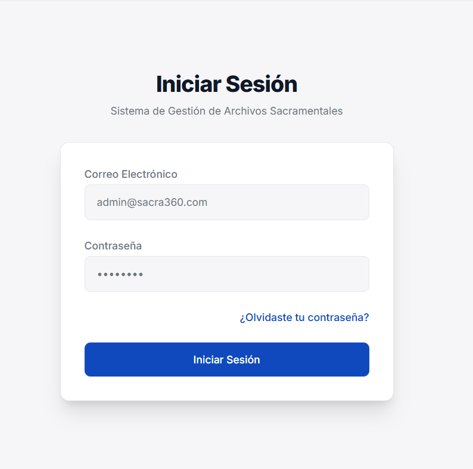

# MANUAL DE USUARIO - SISTEMA SACRA360
## GESTIÓN DE ARCHIVOS SACRAMENTALES

---

## INTRODUCCIÓN

Este manual está dirigido a los usuarios que interactúan con el módulo de **Gestión de Usuarios, Autenticación y Permisos** del sistema SACRA360. El sistema cuenta con diferentes tipos de usuarios según sus roles y permisos:

**Administrador:** Usuario con acceso completo al sistema. Tiene permisos para gestionar usuarios, roles, permisos, visualizar auditoría completa y generar reportes detallados.

**Operador:** Usuario con permisos limitados para consultar información, gestionar ciertos módulos según su rol asignado.

**Consulta:** Usuario con permisos de solo lectura para visualizar información sin capacidad de modificación.

---

## 1. INICIO DE SESIÓN

El sistema SACRA360 cuenta con un formulario de inicio de sesión seguro que permite el acceso a usuarios registrados. Esta pantalla es el punto de entrada al sistema y valida las credenciales mediante autenticación JWT.

### Acceso al Sistema

Para acceder al sistema, el usuario debe dirigirse a la URL del sistema SACRA360 donde se mostrará automáticamente la pantalla de inicio de sesión.



### Proceso de Inicio de Sesión

1. **Ingreso de Credenciales:**
   - En el campo **"Usuario"**, ingrese su nombre de usuario asignado por el administrador del sistema.
   - En el campo **"Contraseña"**, ingrese su contraseña personal.
   - El campo de contraseña oculta los caracteres por seguridad (aparecen como puntos o asteriscos).

2. **Autenticación:**
   - Presione el botón **"Iniciar Sesión"** para enviar sus credenciales.
   - El sistema validará su usuario y contraseña contra la base de datos.
   - Si las credenciales son correctas, el sistema generará un token JWT (JSON Web Token) para mantener su sesión segura.

3. **Acceso Exitoso:**
   - Una vez autenticado correctamente, será redirigido automáticamente al **Dashboard Principal**.
   - El sistema mostrará un mensaje de bienvenida con su nombre de usuario.
   - Su token de sesión se almacenará de forma segura para mantener la sesión activa.

(Imagen: Dashboard principal después del login exitoso. Se debe ver la barra de navegación superior con el nombre del usuario, menú lateral izquierdo con opciones según permisos, y tarjetas con estadísticas en el área central)

### Mensajes de Error

El sistema puede mostrar los siguientes mensajes de error durante el inicio de sesión:

**"Credenciales inválidas":**
- Aparece cuando el usuario o contraseña son incorrectos.
- Verifique que ha escrito correctamente sus credenciales.
- Asegúrese de que la tecla Bloq Mayús no esté activada.

**"Usuario no encontrado":**
- El nombre de usuario ingresado no existe en el sistema.
- Contacte al administrador si cree que debería tener acceso.

**"Usuario desactivado":**
- Su cuenta de usuario ha sido desactivada temporalmente.
- Contacte al administrador del sistema para reactivar su cuenta.

**"Error de conexión":**
- No se pudo conectar con el servidor.
- Verifique su conexión a internet.
- Si el problema persiste, contacte al soporte técnico.

(Imagen: Ejemplo de mensaje de error en la pantalla de login. Se debe ver el formulario con un mensaje de error en rojo debajo de los campos, con un icono de alerta)

### Seguridad de la Sesión

- **Tiempo de Sesión:** Su sesión permanecerá activa durante un período determinado. Después de este tiempo de inactividad, deberá iniciar sesión nuevamente.
  
- **Token Expirado:** Si su token de sesión expira, el sistema lo redirigirá automáticamente a la pantalla de inicio de sesión con un mensaje indicando que debe autenticarse nuevamente.

- **Cierre de Sesión Automático:** Por seguridad, siempre cierre su sesión al terminar de usar el sistema, especialmente si usa una computadora compartida.

### Recomendaciones de Seguridad

1. **Nunca comparta su contraseña** con otras personas, ni siquiera con el personal técnico.

2. **Use contraseñas seguras** que combinen letras mayúsculas, minúsculas, números y caracteres especiales.

3. **Cambie su contraseña periódicamente** para mantener la seguridad de su cuenta.

4. **No deje su sesión abierta** en computadoras públicas o compartidas.

5. **Cierre sesión correctamente** usando el botón de cerrar sesión en lugar de simplemente cerrar el navegador.

---

## 2. DASHBOARD PRINCIPAL

El Dashboard es la pantalla principal del sistema que se muestra inmediatamente después de iniciar sesión correctamente. Proporciona una vista general del estado del sistema con estadísticas en tiempo real.

### Descripción General

El Dashboard está dividido en varias secciones que muestran información relevante según los permisos del usuario:

(Imagen: Vista completa del Dashboard. Se debe ver la barra de navegación superior con el nombre y foto del usuario, menú lateral con todas las opciones, y el área central con 4-6 tarjetas de estadísticas mostrando números grandes con iconos coloridos)

### Componentes del Dashboard

#### 1. Barra de Navegación Superior
- **Logo del Sistema:** SACRA360 en la esquina superior izquierda
- **Información del Usuario:** Nombre del usuario logueado y rol asignado
- **Notificaciones:** Icono de campana con contador de notificaciones (si aplica)
- **Perfil:** Acceso rápido a la configuración de perfil personal
- **Cerrar Sesión:** Botón para salir del sistema de forma segura

#### 2. Menú Lateral
El menú lateral muestra las opciones disponibles según el rol del usuario:

**Para Administradores:**
- Dashboard
- Usuarios
- Auditoría
- Reportes
- Configuración

**Para Operadores:**
- Dashboard
- Consultas (limitadas)
- Mi Perfil

**Para Usuarios de Consulta:**
- Dashboard (vista limitada)
- Mi Perfil

(Imagen: Menú lateral expandido mostrando todas las opciones con iconos. Se debe ver cada opción con su icono correspondiente, el menú activo debe estar resaltado en color diferente)

#### 3. Tarjetas de Estadísticas

El Dashboard muestra tarjetas con información estadística en tiempo real:

**Tarjeta "Total de Usuarios":**
- Muestra el número total de usuarios registrados en el sistema
- Incluye un icono de grupo de personas
- Color: Azul

**Tarjeta "Usuarios Activos":**
- Muestra el número de usuarios activos (no desactivados)
- Incluye un icono de usuario con check
- Color: Verde

**Tarjeta "Usuarios Inactivos":**
- Muestra el número de usuarios desactivados
- Incluye un icono de usuario con X
- Color: Rojo

**Tarjeta "Accesos Hoy":**
- Muestra el número de inicios de sesión del día actual
- Incluye un icono de login/entrada
- Color: Amarillo/Naranja

**Tarjeta "Registros de Auditoría":**
- Muestra el número total de acciones registradas en el sistema
- Incluye un icono de historial/reloj
- Color: Púrpura

**Tarjeta "Roles Configurados":**
- Muestra el número de roles disponibles en el sistema
- Incluye un icono de etiquetas/badges
- Color: Índigo

(Imagen: Detalle de una tarjeta de estadística. Se debe ver una tarjeta rectangular con fondo de color, un icono grande en la parte izquierda, el número de la estadística en tamaño grande en el centro, y el título de la estadística en la parte inferior)

### Actualización de Estadísticas

- Las estadísticas se **actualizan automáticamente** al cargar el Dashboard
- Los datos se obtienen en tiempo real desde la base de datos
- Para actualizar manualmente, puede recargar la página con F5 o el botón de actualizar del navegador

### Navegación desde el Dashboard

Desde el Dashboard puede acceder a cualquier módulo del sistema:

1. **Usando el Menú Lateral:**
   - Haga clic en cualquier opción del menú lateral
   - La opción activa se resalta con color diferente
   - El contenido del área principal cambia según la opción seleccionada

2. **Usando Atajos (si aplica):**
   - Algunas tarjetas del Dashboard son clicables
   - Al hacer clic, lo redirigen al módulo correspondiente
   - Por ejemplo: clic en "Total de Usuarios" → Módulo de Usuarios

(Imagen: Dashboard con cursor sobre una opción del menú lateral. Se debe ver el efecto hover en la opción, indicando que es clickeable)

---

## 3. GESTIÓN DE USUARIOS

El módulo de Gestión de Usuarios permite a los administradores crear, visualizar, modificar y gestionar los usuarios del sistema, así como asignar roles y permisos.

### 3.1. VISUALIZACIÓN DE USUARIOS

Al acceder al módulo de Usuarios desde el menú lateral, se muestra una tabla completa con todos los usuarios registrados en el sistema.

(Imagen: Tabla de usuarios completa. Se debe ver una tabla con columnas: ID, Nombre, Email, Rol, Estado (Activo/Inactivo), Fecha de Creación, y columna de Acciones con botones de Editar/Eliminar/Ver. En la parte superior debe haber un botón "+ Nuevo Usuario" y un campo de búsqueda)

#### Componentes de la Vista

**Barra Superior:**
- **Botón "+ Nuevo Usuario":** Botón principal de color azul para crear usuarios
- **Campo de Búsqueda:** Permite buscar usuarios por nombre, email o rol
- **Filtros:** Opciones para filtrar por estado (Activo/Inactivo) y por rol

**Tabla de Usuarios:**
- **ID:** Identificador único del usuario
- **Nombre Completo:** Nombre y apellidos del usuario
- **Email:** Correo electrónico (usado para login en algunos casos)
- **Usuario:** Nombre de usuario para login
- **Rol:** Rol asignado (Administrador, Operador, Consulta)
- **Estado:** Badge de color (Verde = Activo, Rojo = Inactivo)
- **Fecha de Creación:** Fecha de registro en el sistema
- **Última Conexión:** Fecha y hora del último inicio de sesión
- **Acciones:** Botones para Ver, Editar, Eliminar/Desactivar

(Imagen: Detalle de una fila de la tabla de usuarios. Se debe ver cada columna claramente, el badge de estado en color, y los tres botones de acción en la última columna con iconos de ojo, lápiz y papelera)

#### Búsqueda y Filtros

**Búsqueda de Usuarios:**
1. En el campo de búsqueda, ingrese el texto a buscar
2. El sistema busca en tiempo real en los campos: nombre, email, usuario
3. La tabla se actualiza automáticamente mostrando solo los resultados coincidentes

**Filtros Disponibles:**
- **Por Estado:** 
  - Todos
  - Solo Activos
  - Solo Inactivos
  
- **Por Rol:**
  - Todos los roles
  - Administrador
  - Operador
  - Consulta

(Imagen: Barra de filtros expandida. Se debe ver dropdowns de "Estado" y "Rol" con las opciones visibles, y el campo de búsqueda a la derecha)

#### Paginación

La tabla implementa paginación para manejar grandes cantidades de usuarios:

- **Registros por página:** 10 usuarios por defecto
- **Navegación:** Botones "Anterior" y "Siguiente"
- **Números de página:** Muestra las páginas disponibles (1, 2, 3...)
- **Contador:** "Mostrando X - Y de Z registros"

(Imagen: Barra de paginación en la parte inferior de la tabla. Se debe ver "Anterior", números de página (con la página actual resaltada), "Siguiente", y el contador de registros)

---

### 3.2. CREAR NUEVO USUARIO

Los administradores pueden crear nuevos usuarios en el sistema asignándoles roles y permisos específicos.

#### Proceso de Creación

1. **Acceder al Formulario:**
   - Haga clic en el botón **"+ Nuevo Usuario"** en la parte superior derecha
   - Se abrirá un modal o formulario para ingresar los datos

(Imagen: Modal de "Crear Nuevo Usuario". Se debe ver un formulario con campos para: Nombre, Apellido, Email, Usuario, Contraseña, Confirmar Contraseña, Rol (dropdown), Estado (toggle Activo/Inactivo), y botones "Cancelar" y "Crear Usuario")

2. **Completar Información Obligatoria:**

   **Datos Personales:**
   - **Nombre:** Ingrese el nombre del usuario
   - **Apellido:** Ingrese el apellido del usuario
   - **Email:** Correo electrónico válido (debe ser único)
   
   **Credenciales de Acceso:**
   - **Usuario:** Nombre de usuario para login (debe ser único, sin espacios)
   - **Contraseña:** Contraseña segura (mínimo 8 caracteres, debe incluir mayúsculas, minúsculas y números)
   - **Confirmar Contraseña:** Repita la contraseña para validación
   
   **Configuración:**
   - **Rol:** Seleccione el rol del menú desplegable (Administrador/Operador/Consulta)
   - **Estado:** Toggle para activar o desactivar el usuario al crearlo

3. **Validaciones del Sistema:**

   El sistema valida automáticamente:
   - ✓ Todos los campos obligatorios están completos
   - ✓ El formato del email es válido
   - ✓ El nombre de usuario no existe ya en el sistema
   - ✓ El email no está registrado previamente
   - ✓ Las contraseñas coinciden
   - ✓ La contraseña cumple con los requisitos de seguridad

   (Imagen: Formulario mostrando mensajes de error de validación. Se debe ver campos con borde rojo y mensajes de error en rojo debajo de cada campo problemático, por ejemplo: "El email ya está registrado", "Las contraseñas no coinciden")

4. **Guardar Usuario:**
   - Haga clic en el botón **"Crear Usuario"**
   - El sistema valida toda la información
   - Si todo es correcto, muestra mensaje de éxito: "Usuario creado exitosamente"
   - La tabla se actualiza automáticamente mostrando el nuevo usuario

(Imagen: Mensaje de éxito. Se debe ver una notificación verde en la parte superior de la pantalla con un icono de check y el texto "Usuario creado exitosamente")

#### Roles y Permisos

Al seleccionar un rol, el sistema asigna automáticamente los permisos correspondientes:

**Rol Administrador:**
- Acceso completo al sistema
- Gestión de usuarios (crear, editar, eliminar)
- Visualización completa de auditoría
- Generación de todos los reportes
- Configuración del sistema

**Rol Operador:**
- Acceso limitado según módulos asignados
- Consulta de información
- Operaciones básicas en módulos permitidos
- Sin acceso a configuración ni gestión de usuarios

**Rol Consulta:**
- Solo visualización de información
- Sin permisos de modificación
- Acceso limitado a reportes básicos

---

### 3.3. EDITAR USUARIO

Los administradores pueden modificar la información de usuarios existentes.

#### Proceso de Edición

1. **Acceder a Edición:**
   - En la tabla de usuarios, localice el usuario a modificar
   - Haga clic en el botón de **Editar** (icono de lápiz) en la columna de Acciones
   - Se abrirá un formulario pre-llenado con los datos actuales del usuario

(Imagen: Modal de "Editar Usuario". Se debe ver el mismo formulario que crear usuario pero con los campos ya completados con la información actual del usuario. El título debe decir "Editar Usuario: [Nombre del Usuario]")

2. **Modificar Información:**
   - Puede modificar cualquier campo excepto el ID
   - El campo "Usuario" puede estar bloqueado para no duplicar
   - Para cambiar contraseña, ingrese una nueva y confírmela
   - Si no desea cambiar la contraseña, deje los campos en blanco

3. **Campos Editables:**
   - Nombre y Apellido
   - Email (debe ser único si se cambia)
   - Rol asignado
   - Estado (Activo/Inactivo)
   - Contraseña (opcional)

4. **Guardar Cambios:**
   - Haga clic en **"Guardar Cambios"**
   - El sistema valida la información modificada
   - Muestra mensaje de confirmación: "Usuario actualizado exitosamente"
   - La tabla se actualiza con los nuevos datos

(Imagen: Fila de usuario en la tabla después de ser editada. Se debe ver la información actualizada resaltada brevemente con un efecto de fade o color para indicar que fue modificada recientemente)

#### Restricciones de Edición

- No puede editar su propio rol si es el único administrador
- No puede desactivar su propia cuenta
- No puede eliminar el usuario con el que está logueado
- Los cambios se registran en el módulo de Auditoría

---

### 3.4. DESACTIVAR / ELIMINAR USUARIO

El sistema permite desactivar usuarios en lugar de eliminarlos permanentemente, manteniendo la integridad de los registros históricos.

#### Desactivación de Usuario (Baja Lógica)

1. **Acceder a Desactivación:**
   - En la tabla de usuarios, localice el usuario
   - Haga clic en el botón de **Eliminar** (icono de papelera)
   - Aparecerá un modal de confirmación

(Imagen: Modal de confirmación de desactivación. Se debe ver un diálogo con el mensaje "¿Está seguro que desea desactivar al usuario [Nombre]? Esta acción puede revertirse.", con botones "Cancelar" (gris) y "Desactivar" (rojo))

2. **Confirmar Acción:**
   - Lea el mensaje de confirmación
   - Haga clic en **"Desactivar"** para confirmar
   - El usuario cambiará a estado "Inactivo"
   - El badge de estado cambiará a rojo

3. **Efectos de la Desactivación:**
   - El usuario NO puede iniciar sesión
   - La información del usuario se mantiene en el sistema
   - Aparece en la tabla con estado "Inactivo"
   - Puede ser reactivado posteriormente
   - Todas las acciones previas en auditoría se conservan

(Imagen: Usuario desactivado en la tabla. Se debe ver la fila con el badge "Inactivo" en rojo, y en la columna de acciones debe aparecer un botón adicional "Reactivar" en verde)

---

### 3.5. REACTIVAR USUARIO

Los usuarios desactivados pueden ser reactivados por un administrador.

#### Proceso de Reactivación

1. **Filtrar Usuarios Inactivos:**
   - Use el filtro "Estado" → "Solo Inactivos"
   - La tabla mostrará únicamente usuarios desactivados

2. **Reactivar Usuario:**
   - Localice el usuario a reactivar
   - Haga clic en el botón **"Reactivar"** (icono de check o play)
   - Aparecerá un modal de confirmación

(Imagen: Modal de confirmación de reactivación. Se debe ver "¿Desea reactivar al usuario [Nombre]?" con botones "Cancelar" y "Reactivar" en verde)

3. **Confirmar Reactivación:**
   - Haga clic en **"Reactivar"**
   - El usuario cambia a estado "Activo"
   - El badge cambia a color verde
   - El usuario puede iniciar sesión nuevamente

4. **Notificación:**
   - Sistema muestra: "Usuario reactivado exitosamente"
   - La acción se registra en auditoría

---

### 3.6. VER DETALLES DE USUARIO

Puede visualizar información detallada de cualquier usuario sin modificarla.

#### Visualización de Detalles

1. **Acceder a Detalles:**
   - Haga clic en el botón **Ver** (icono de ojo) en la columna Acciones
   - Se abrirá un modal o página con información completa

(Imagen: Modal "Detalles del Usuario". Se debe ver información organizada en secciones: Datos Personales (nombre, email), Información de Cuenta (usuario, rol, estado), Fechas (creación, última modificación, última conexión), y Estadísticas (número de accesos, acciones realizadas))

2. **Información Mostrada:**
   
   **Datos Personales:**
   - Nombre completo
   - Email
   - Teléfono (si aplica)
   
   **Información de la Cuenta:**
   - Nombre de usuario
   - Rol asignado
   - Estado actual (Activo/Inactivo)
   - Permisos específicos
   
   **Fechas Relevantes:**
   - Fecha de creación
   - Última modificación
   - Última conexión
   - Creado por (usuario que lo creó)
   
   **Estadísticas de Uso:**
   - Número total de accesos al sistema
   - Última IP de conexión
   - Número de acciones en auditoría

3. **Acciones Disponibles:**
   - Botón **"Editar"** para modificar información
   - Botón **"Ver Auditoría"** para ver acciones del usuario
   - Botón **"Cerrar"** para volver a la lista

---

## 4. MÓDULO DE AUDITORÍA

El módulo de Auditoría registra y muestra todas las acciones realizadas en el sistema, permitiendo trazabilidad completa de las operaciones y garantizando la transparencia y seguridad.

### 4.1. VISUALIZACIÓN DE REGISTROS DE AUDITORÍA

Al acceder al módulo de Auditoría desde el menú lateral, se muestra una tabla completa con todos los eventos registrados en el sistema.

(Imagen: Pantalla completa del módulo de Auditoría. Se debe ver una tabla con columnas: ID, Usuario, Acción, Módulo, Detalles, IP, Fecha/Hora, y en la parte superior filtros de búsqueda y selección de fechas, usuario y tipo de acción)

#### Componentes de la Vista

**Barra de Filtros Superior:**
- **Campo de Búsqueda General:** Busca en todos los campos de texto
- **Filtro por Usuario:** Dropdown con lista de todos los usuarios
- **Filtro por Acción:** Dropdown con tipos de acciones (Login, Crear, Editar, Eliminar, etc.)
- **Filtro por Módulo:** Dropdown con módulos del sistema (Usuarios, Documentos, Reportes, etc.)
- **Filtro por Fecha:** Selector de rango de fechas (Desde - Hasta)
- **Botón "Limpiar Filtros":** Resetea todos los filtros
- **Botón "Exportar":** Descarga el registro de auditoría en formato CSV o PDF

(Imagen: Barra de filtros expandida con todos los dropdowns visibles. Se debe ver cada filtro con sus opciones, el selector de fechas mostrando un calendario, y los botones de acción en el extremo derecho)

**Tabla de Registros:**

La tabla muestra cada evento de auditoría con la siguiente información:

- **ID:** Identificador único del registro
- **Usuario:** Nombre del usuario que realizó la acción
- **Acción:** Tipo de acción realizada (Login, Logout, Crear Usuario, Editar Documento, etc.)
- **Módulo:** Módulo del sistema donde se realizó la acción
- **Descripción:** Detalles específicos de la acción
- **Dirección IP:** IP desde donde se realizó la acción
- **Fecha y Hora:** Timestamp exacto del evento (formato: DD/MM/YYYY HH:MM:SS)
- **Estado:** Badge indicando éxito (verde) o error (rojo)

(Imagen: Detalle de varias filas de la tabla de auditoría. Se debe ver diferentes tipos de acciones con sus iconos, badges de estado en diferentes colores, y timestamps claramente visibles)

#### Tipos de Acciones Registradas

El sistema registra las siguientes acciones:

**Autenticación:**
- ✓ Login exitoso
- ✗ Intento de login fallido
- ⊗ Logout

**Gestión de Usuarios:**
- ➕ Crear usuario
- ✎ Editar usuario
- ✓ Activar usuario
- ⊗ Desactivar usuario
- 🗑 Eliminar usuario
- 🔒 Cambio de contraseña

**Gestión de Documentos:** (si aplica)
- ➕ Cargar documento
- ✎ Editar documento
- 👁 Visualizar documento
- ⬇ Descargar documento
- 🗑 Eliminar documento

**Reportes:**
- 📊 Generar reporte
- ⬇ Descargar reporte
- 👁 Visualizar estadísticas

**Configuración:**
- ⚙ Cambiar configuración
- 🔧 Modificar permisos

(Imagen: Lista de iconos de tipos de acciones. Se debe ver cada icono con su nombre y un ejemplo de descripción de auditoría)

---

### 4.2. BÚSQUEDA Y FILTROS EN AUDITORÍA

El sistema de auditoría cuenta con potentes herramientas de búsqueda y filtrado para localizar eventos específicos.

#### Búsqueda General

1. **Búsqueda Rápida:**
   - En el campo de búsqueda superior, ingrese cualquier texto
   - El sistema busca en tiempo real en todos los campos
   - Resultados se filtran automáticamente mientras escribe

2. **Búsqueda por Palabras Clave:**
   - Puede buscar nombres de usuarios
   - Tipos de acciones específicas
   - IPs específicas
   - Términos en descripciones

(Imagen: Campo de búsqueda activo con texto ingresado y tabla filtrada mostrando solo resultados coincidentes. Se debe ver el texto de búsqueda resaltado en amarillo en las filas de resultados)

#### Filtros Específicos

**Filtro por Usuario:**
1. Haga clic en el dropdown "Usuario"
2. Seleccione un usuario específico de la lista
3. La tabla muestra solo acciones de ese usuario
4. Puede ver un resumen de actividad del usuario seleccionado

(Imagen: Dropdown de usuarios abierto mostrando lista de todos los usuarios del sistema con sus roles. El usuario seleccionado debe estar resaltado)

**Filtro por Tipo de Acción:**
1. Haga clic en el dropdown "Acción"
2. Opciones disponibles:
   - Todas las acciones
   - Login/Logout
   - Crear
   - Editar
   - Eliminar
   - Desactivar
   - Cambio de contraseña
3. Seleccione el tipo de acción deseado
4. La tabla muestra solo ese tipo de acciones

(Imagen: Dropdown de acciones abierto con iconos para cada tipo de acción. Se debe ver la lista completa con checkmarks en las acciones seleccionadas)

**Filtro por Módulo:**
1. Haga clic en el dropdown "Módulo"
2. Opciones:
   - Todos los módulos
   - Autenticación
   - Usuarios
   - Documentos
   - Reportes
   - Configuración
3. Seleccione el módulo
4. Muestra solo acciones de ese módulo

**Filtro por Rango de Fechas:**
1. Haga clic en el campo "Desde"
2. Seleccione la fecha inicial en el calendario
3. Haga clic en el campo "Hasta"
4. Seleccione la fecha final
5. El sistema filtra automáticamente registros entre esas fechas

(Imagen: Selector de fechas abierto mostrando calendario. Se debe ver el mes actual con las fechas seleccionadas resaltadas, y botones para navegación de meses)

**Filtros Rápidos Predefinidos:**
- **Hoy:** Muestra solo registros del día actual
- **Última Semana:** Últimos 7 días
- **Último Mes:** Últimos 30 días
- **Último Trimestre:** Últimos 90 días

(Imagen: Botones de filtros rápidos en la barra superior. Se debe ver 4 botones con iconos de reloj/calendario, el botón activo debe estar resaltado en azul)

#### Combinación de Filtros

Puede combinar múltiples filtros simultáneamente:

**Ejemplo de Uso:**
- Seleccione Usuario: "Juan Pérez"
- Seleccione Acción: "Login"
- Seleccione Fecha: "Última Semana"
- Resultado: Todos los inicios de sesión de Juan Pérez en los últimos 7 días

#### Limpiar Filtros

1. Haga clic en el botón **"Limpiar Filtros"**
2. Todos los filtros se resetean a valores predeterminados
3. La tabla muestra todos los registros nuevamente
4. El campo de búsqueda se vacía

---

### 4.3. PAGINACIÓN EN AUDITORÍA

El módulo de auditoría implementa un sistema de paginación avanzado para manejar grandes volúmenes de registros.

#### Características de la Paginación

**Registros por Página:**
- Por defecto: 10 registros por página
- Configurable desde el selector en la parte inferior

(Imagen: Selector de registros por página. Se debe ver un dropdown con opciones: 10, 25, 50, 100 registros por página)

**Navegación de Páginas:**

1. **Botones de Navegación:**
   - **« Primera:** Ir a la primera página
   - **‹ Anterior:** Ir a la página anterior
   - **Números (1, 2, 3...):** Ir directamente a una página específica
   - **Siguiente ›:** Ir a la página siguiente
   - **Última »:** Ir a la última página

2. **Página Actual:**
   - La página actual se resalta en azul
   - Se muestra en negrita
   - No es clickeable

(Imagen: Barra de paginación completa en la parte inferior de la tabla. Se debe ver todos los botones de navegación, números de página con la página actual (ej: 3) resaltada en azul, y el contador de registros a la derecha)

3. **Contador de Registros:**
   - Muestra: "Mostrando 11 - 20 de 156 registros"
   - Se actualiza automáticamente al cambiar de página
   - Refleja los filtros aplicados

**Navegación Inteligente:**
- Si hay muchas páginas (más de 7), muestra: 1 ... 4 5 6 ... 20
- Siempre muestra primera y última página
- Muestra páginas cercanas a la actual

#### Interacción con Filtros

- Al aplicar filtros, la paginación se reinicia a la página 1
- El contador refleja solo los registros filtrados
- Ejemplo: "Mostrando 1 - 10 de 45 registros filtrados"

---

### 4.4. DETALLES DE EVENTO DE AUDITORÍA

Puede visualizar información detallada de cualquier evento de auditoría.

#### Ver Detalles

1. **Acceso:**
   - Haga clic en cualquier fila de la tabla de auditoría
   - O haga clic en el icono de **"Ver Detalles"** (si está disponible)
   - Se abrirá un modal con información completa

(Imagen: Modal de "Detalles del Evento de Auditoría". Se debe ver información organizada en bloques: Información del Usuario (nombre, email, rol), Información del Evento (acción, módulo, timestamp), Detalles Técnicos (IP, user agent, duración), Datos Modificados (antes/después si aplica))

2. **Información Detallada:**

   **Bloque de Usuario:**
   - ID de usuario
   - Nombre completo
   - Email
   - Rol
   - Estado de la cuenta al momento del evento

   **Bloque del Evento:**
   - Tipo de acción realizada
   - Módulo afectado
   - Descripción detallada
   - Estado: Éxito o Error
   - Mensaje de error (si aplica)

   **Bloque Técnico:**
   - Dirección IP completa
   - User Agent (navegador/dispositivo)
   - Fecha y hora exacta (con zona horaria)
   - ID de sesión
   - Duración de la operación

   **Cambios Realizados (si aplica):**
   - Valores anteriores (before)
   - Valores nuevos (after)
   - Campos modificados
   - Formato tabla comparativa

(Imagen: Sección de "Cambios Realizados" mostrando tabla de comparación. Se debe ver dos columnas: "Antes" y "Después" con los valores anteriores y nuevos resaltados en colores diferentes - rojo para eliminado, verde para agregado)

3. **Acciones Disponibles:**
   - **Cerrar:** Volver a la tabla de auditoría
   - **Exportar:** Descargar detalles del evento en PDF
   - **Ver Usuario:** Ir al perfil del usuario que realizó la acción

---

### 4.5. EXPORTAR REGISTROS DE AUDITORÍA

Los registros de auditoría pueden exportarse para análisis externo o respaldo.

#### Proceso de Exportación

1. **Aplicar Filtros (Opcional):**
   - Primero filtre los registros que desea exportar
   - Solo se exportarán los registros visibles según filtros activos

2. **Iniciar Exportación:**
   - Haga clic en el botón **"Exportar"** en la parte superior
   - Seleccione el formato deseado:
     - **CSV:** Para análisis en Excel/Google Sheets
     - **PDF:** Para reportes formales
     - **JSON:** Para análisis técnico

(Imagen: Dropdown de opciones de exportación. Se debe ver tres opciones con sus iconos: CSV, PDF, JSON, cada una con una breve descripción)

3. **Configurar Exportación:**
   - **Seleccionar Columnas:** Marque las columnas a incluir
   - **Rango de Fechas:** Confirme o modifique el rango
   - **Incluir Detalles:** Toggle para incluir información completa

4. **Descargar Archivo:**
   - Haga clic en **"Generar Reporte"**
   - El sistema procesa la solicitud
   - Muestra barra de progreso
   - Descarga automática del archivo cuando esté listo

(Imagen: Barra de progreso de exportación. Se debe ver una barra de progreso azul con porcentaje "Generando reporte... 75%" y un spinner/loading icon)

5. **Archivo Generado:**
   - Nombre: `auditoria_YYYY-MM-DD_HHMMSS.csv`
   - Incluye todos los registros filtrados
   - Columnas en orden lógico
   - Formato compatible con análisis de datos

#### Formato CSV

El archivo CSV incluye las siguientes columnas:
```
ID | Usuario | Email | Rol | Acción | Módulo | Descripción | IP | Fecha | Hora | Estado
```

#### Formato PDF

El PDF genera un reporte formal con:
- Encabezado con logo del sistema
- Título: "Reporte de Auditoría"
- Fecha de generación
- Filtros aplicados
- Tabla con registros
- Total de registros
- Pie de página con numeración

(Imagen: Vista previa de reporte PDF. Se debe ver primera página con encabezado corporativo, título del reporte, tabla de registros con formato profesional, y pie de página)

---

## 5. MÓDULO DE REPORTES

El módulo de Reportes proporciona estadísticas detalladas y visualizaciones sobre el uso del sistema, usuarios y accesos. Permite generar reportes personalizados y exportarlos en diferentes formatos.

### 5.1. PANTALLA PRINCIPAL DE REPORTES

Al acceder al módulo de Reportes, se muestra un dashboard con estadísticas visuales y opciones para generar reportes detallados.

(Imagen: Pantalla completa del módulo de Reportes. Se debe ver en la parte superior botones de filtros por período (7, 30, 90, 365 días), en el centro tarjetas con estadísticas principales, y en la parte inferior gráficos de barras y líneas mostrando tendencias)

#### Componentes de la Vista

**Barra de Filtros por Período:**

Botones de selección rápida de período:
- **7 días:** Última semana
- **30 días:** Último mes  
- **90 días:** Último trimestre
- **365 días:** Último año
- **Personalizado:** Selector de rango de fechas manual

(Imagen: Barra de botones de período. Se debe ver 5 botones, el botón del período activo (ej: 30 días) debe estar resaltado en azul, los demás en gris)

**Tarjetas de Estadísticas Generales:**

Las tarjetas muestran métricas clave del período seleccionado:

1. **Total de Usuarios Registrados:**
   - Número total de usuarios en el sistema
   - Icono: Grupo de personas
   - Color: Azul
   - Comparación con período anterior (↑ +5% vs período anterior)

2. **Usuarios Activos:**
   - Usuarios con estado activo
   - Porcentaje del total
   - Icono: Usuario con check
   - Color: Verde

3. **Usuarios Inactivos:**
   - Usuarios desactivados
   - Porcentaje del total
   - Icono: Usuario con X
   - Color: Rojo

4. **Total de Accesos:**
   - Número de inicios de sesión en el período
   - Promedio diario
   - Icono: Login/Puerta
   - Color: Púrpura

5. **Acciones Registradas:**
   - Total de eventos en auditoría
   - Promedio por usuario
   - Icono: Actividad/Gráfico
   - Color: Naranja

6. **Horario Pico:**
   - Hora con más actividad
   - Número de accesos en ese horario
   - Icono: Reloj
   - Color: Índigo

(Imagen: Conjunto de 6 tarjetas de estadísticas en formato grid 3x2. Cada tarjeta debe mostrar el icono grande a la izquierda, el número principal en grande al centro, el título abajo, y una pequeña etiqueta de comparación o promedio en la esquina superior derecha)

---

### 5.2. REPORTE DE USUARIOS

Genera estadísticas detalladas sobre los usuarios del sistema.

#### Tipos de Reportes de Usuarios

**5.2.1. Resumen General de Usuarios:**

Muestra vista consolidada de todos los usuarios:

**Información Incluida:**
- Total de usuarios registrados
- Distribución por rol (gráfico de torta)
- Distribución por estado (Activos/Inactivos)
- Usuarios creados en el período seleccionado
- Usuarios modificados recientemente
- Usuarios que nunca han iniciado sesión

(Imagen: Gráfico de torta mostrando "Distribución de Usuarios por Rol". Se debe ver un gráfico circular dividido en 3 sectores de diferentes colores: Administradores (rojo), Operadores (azul), Consulta (verde), con porcentajes en cada sector y leyenda a la derecha)

**Tabla Resumen:**
```
| Rol          | Total | Activos | Inactivos | % del Total |
|--------------|-------|---------|-----------|-------------|
| Administrador|   5   |    5    |     0     |    5%       |
| Operador     |  45   |   42    |     3     |   45%       |
| Consulta     |  50   |   48    |     2     |   50%       |
| TOTAL        | 100   |   95    |     5     |   100%      |
```

(Imagen: Tabla resumen de usuarios por rol. Se debe ver la tabla con las columnas indicadas, filas con datos, y la fila de TOTAL resaltada con fondo gris claro)

**5.2.2. Usuarios Activos/Inactivos:**

Reporte específico de la actividad de usuarios:

**Métricas Mostradas:**
- Lista de usuarios activos con última conexión
- Lista de usuarios inactivos (desactivados)
- Usuarios sin actividad reciente (más de 30 días sin login)
- Usuarios con alta actividad (top 10 más activos)
- Usuarios con baja actividad (menos accesos)

(Imagen: Gráfico de barras horizontales "Top 10 Usuarios Más Activos". Se debe ver barras horizontales ordenadas de mayor a menor, con el nombre del usuario a la izquierda y el número de accesos en la barra, coloreadas en gradiente de azul)

**Tabla de Usuarios sin Actividad Reciente:**
- Nombre del usuario
- Rol
- Fecha del último acceso
- Días sin actividad
- Acción sugerida (Desactivar/Contactar)

(Imagen: Tabla de usuarios sin actividad. Se debe ver columnas con nombres, fechas, y un contador de días en rojo cuando supera los 30 días)

**5.2.3. Usuarios por Rol:**

Análisis detallado por cada rol del sistema:

Para cada rol muestra:
- Número total de usuarios con ese rol
- Porcentaje del total
- Usuarios activos vs inactivos
- Promedio de accesos por usuario de ese rol
- Acciones más comunes realizadas por ese rol

**Gráfico de Evolución:**
- Línea de tiempo mostrando creación de usuarios por rol
- Eje X: Meses
- Eje Y: Número de usuarios
- Líneas de diferentes colores por rol

(Imagen: Gráfico de líneas mostrando evolución de usuarios por rol en los últimos 12 meses. Se debe ver 3 líneas de diferentes colores (una por rol), eje X con meses abreviados, eje Y con números, y leyenda identificando cada línea)

---

### 5.3. REPORTE DE ACCESOS

Analiza los inicios de sesión y patrones de acceso al sistema.

#### Tipos de Reportes de Accesos

**5.3.1. Resumen de Accesos:**

Estadísticas generales de autenticación:

**Métricas Principales:**
- Total de accesos en el período
- Accesos exitosos
- Intentos fallidos
- Promedio de accesos por día
- Día con más accesos
- Hora pico de accesos

**Gráfico de Barras - Accesos por Día:**
- Muestra número de accesos cada día del período
- Barras verdes para accesos exitosos
- Barras rojas para intentos fallidos
- Permite identificar patrones y picos de uso

(Imagen: Gráfico de barras verticales "Accesos Diarios - Últimos 30 Días". Se debe ver barras verdes y rojas (apiladas o lado a lado) para cada día, eje X con fechas, eje Y con número de accesos, tooltip mostrando detalles al pasar el mouse)

**5.3.2. Accesos por Usuario:**

Detalle de accesos de cada usuario:

**Tabla Detallada:**
```
| Usuario      | Total Accesos | Exitosos | Fallidos | Última Conexión | IP Más Usada |
|--------------|---------------|----------|----------|-----------------|--------------|
| Juan Pérez   |      156      |   154    |    2     | 10/12/24 09:30  | 192.168.1.5  |
| María López  |       89      |    88    |    1     | 10/12/24 14:15  | 192.168.1.8  |
```

(Imagen: Tabla de accesos por usuario con scroll vertical. Se debe ver todas las columnas claramente, números alineados a la derecha, y la fila con intentos fallidos mayores a 0 resaltada en amarillo claro como advertencia)

**Filtros Disponibles:**
- Por usuario específico
- Por rango de fechas
- Solo accesos exitosos / solo fallidos
- Por dirección IP

**5.3.3. Últimos Accesos:**

Lista de los accesos más recientes al sistema:

**Información Mostrada:**
- Usuario que inició sesión
- Fecha y hora exacta
- Dirección IP
- Navegador/Dispositivo (User Agent)
- Duración de la sesión
- Estado (Activa/Cerrada)

(Imagen: Lista de últimos accesos en formato cronológico inverso. Se debe ver cada acceso como una tarjeta con icono de usuario a la izquierda, nombre y hora en grande, IP y navegador en texto pequeño, y badge de "Sesión Activa" en verde o "Sesión Cerrada" en gris)

**Actualización en Tiempo Real:**
- Los últimos accesos se actualizan automáticamente cada 30 segundos
- Indicador visual de "actualizando..." durante la carga
- Notificación cuando hay nuevos accesos

---

### 5.4. ESTADÍSTICAS GENERALES

Reporte consolidado con métricas globales del sistema.

#### Secciones del Reporte

**5.4.1. Actividad General:**

Métricas de uso del sistema:

**Panel de Métricas:**
- **Acciones Totales:** Número total de eventos registrados
- **Promedio Diario:** Acciones promedio por día
- **Pico de Actividad:** Día y hora con más acciones
- **Módulo Más Usado:** Módulo con más interacciones
- **Acción Más Común:** Tipo de acción más frecuente

**Gráfico de Calor - Actividad por Hora:**

Matriz que muestra actividad por día de la semana y hora del día:
- Eje Y: Días de la semana (Lun - Dom)
- Eje X: Horas del día (00:00 - 23:00)
- Color: Intensidad de actividad (claro = poco, oscuro = mucho)

(Imagen: Mapa de calor (heatmap) de actividad. Se debe ver una cuadrícula de 7x24 con celdas coloreadas en gradiente de azul, donde las celdas más oscuras indican mayor actividad. Incluir escala de colores a la derecha)

**5.4.2. Rendimiento del Sistema:**

Métricas técnicas:
- Tiempo de respuesta promedio de endpoints
- Número de errores registrados
- Tasa de éxito de operaciones
- Endpoints más lentos
- Errores más frecuentes

(Imagen: Gráfico de líneas "Tiempo de Respuesta Promedio - Últimos 7 Días". Se debe ver línea mostrando variación del tiempo de respuesta, línea de referencia punteada indicando el objetivo de rendimiento, eje Y en milisegundos)

**5.4.3. Distribución de Acciones:**

Análisis de tipos de acciones realizadas:

**Gráfico de Torta - Acciones por Tipo:**
- Login/Logout: X%
- Creación de registros: Y%
- Edición de registros: Z%
- Eliminación: W%
- Consultas: V%
- Otros: U%

(Imagen: Gráfico de torta con segmentos de diferentes colores. Cada segmento debe mostrar el porcentaje, y al pasar el mouse debe mostrar tooltip con el número exacto de acciones)

**Tabla Detallada:**
```
| Tipo de Acción     | Cantidad | % del Total | Promedio Diario |
|--------------------|----------|-------------|-----------------|
| Login              |  3,450   |    25%      |      115        |
| Crear Documento    |  2,100   |    15%      |       70        |
| Editar Documento   |  4,200   |    30%      |      140        |
| Ver Documento      |  3,150   |    23%      |      105        |
| Eliminar Documento |    450   |     3%      |       15        |
| Otros              |    650   |     4%      |       22        |
| TOTAL              | 14,000   |   100%      |      467        |
```

---

### 5.5. GENERACIÓN DE REPORTES PERSONALIZADOS

Cree reportes personalizados según sus necesidades específicas.

#### Proceso de Creación

1. **Acceder a Generación:**
   - Haga clic en el botón **"Generar Reporte Personalizado"**
   - Se abrirá un formulario de configuración

(Imagen: Formulario de "Generar Reporte Personalizado". Se debe ver un wizard con 3 pasos: 1) Seleccionar Tipo, 2) Configurar Parámetros, 3) Vista Previa, con indicadores de progreso en la parte superior)

2. **Paso 1: Seleccionar Tipo de Reporte:**

   Opciones disponibles:
   - ☐ Reporte de Usuarios
   - ☐ Reporte de Accesos
   - ☐ Reporte de Auditoría
   - ☐ Estadísticas Generales
   - ☐ Reporte Combinado (múltiples secciones)

3. **Paso 2: Configurar Parámetros:**

   **Período de Tiempo:**
   - Selector de rango de fechas (Desde - Hasta)
   - O botones de período rápido (7/30/90/365 días)

   **Filtros Específicos:**
   - Por usuario(s) específico(s)
   - Por rol(es)
   - Por tipo(s) de acción
   - Por módulo(s)
   - Por estado (activo/inactivo)

   **Opciones de Visualización:**
   - ☑ Incluir gráficos
   - ☑ Incluir tablas detalladas
   - ☑ Incluir comparaciones con período anterior
   - ☐ Incluir datos técnicos (IPs, User Agents)
   - ☑ Agrupar por fecha
   - ☐ Agrupar por usuario

(Imagen: Panel de configuración de parámetros. Se debe ver selectores de fecha, checkboxes para opciones, dropdowns de filtros, todo organizado en secciones colapsables)

4. **Paso 3: Vista Previa:**

   Antes de generar, visualice cómo se verá el reporte:
   - Resumen de configuración seleccionada
   - Vista previa de las primeras filas de datos
   - Estimación de número de páginas (para PDF)
   - Tamaño aproximado del archivo

(Imagen: Panel de vista previa. Se debe ver un resumen en formato lista de todas las opciones seleccionadas, y una tabla de muestra con los primeros registros que se incluirán)

5. **Generar y Descargar:**

   **Seleccionar Formato:**
   - **PDF:** Reporte formal imprimible
   - **Excel (XLSX):** Para análisis de datos
   - **CSV:** Datos en texto plano
   - **JSON:** Para procesamiento automatizado

   **Generar:**
   - Haga clic en **"Generar Reporte"**
   - Barra de progreso muestra el avance
   - Descarga automática cuando esté listo

(Imagen: Modal de generación en progreso. Se debe ver barra de progreso azul con porcentaje "Generando reporte... 67%", spinner animado, texto "Procesando datos...", y botón "Cancelar" en gris)

---

### 5.6. PROGRAMACIÓN DE REPORTES AUTOMÁTICOS

Configure reportes para que se generen y envíen automáticamente según un calendario.

#### Crear Reporte Programado

1. **Acceder a Programación:**
   - Haga clic en **"Reportes Programados"** en el menú
   - Haga clic en **"+ Nuevo Reporte Programado"**

(Imagen: Pantalla de lista de reportes programados. Se debe ver una tabla con columnas: Nombre, Tipo, Frecuencia, Destinatarios, Próxima Ejecución, Estado (Activo/Pausado), Acciones. Botón "+ Nuevo Reporte Programado" en la esquina superior derecha en azul)

2. **Configurar Reporte:**

   **Información General:**
   - **Nombre del Reporte:** Identificador descriptivo
   - **Descripción:** Detalle del propósito (opcional)
   - **Tipo de Reporte:** Seleccione de la lista

   **Configuración de Parámetros:**
   - Configure los mismos parámetros que reporte manual
   - Los períodos se calculan automáticamente (ej: "Últimos 7 días" siempre será dinámico)

   **Programación:**
   - **Frecuencia:**
     - Diaria (seleccione hora)
     - Semanal (seleccione día y hora)
     - Mensual (seleccione día del mes y hora)
     - Trimestral
   - **Zona Horaria:** Seleccione zona horaria correcta

(Imagen: Formulario de configuración de frecuencia. Se debe ver radio buttons para frecuencia, selectores de día/hora según la opción elegida, y selector de zona horaria)

   **Destinatarios:**
   - Lista de correos electrónicos separados por coma
   - O seleccione usuarios del sistema
   - O seleccione roles (todos los usuarios de un rol)

   **Formato de Envío:**
   - PDF adjunto
   - Excel adjunto
   - Ambos formatos
   - Link de descarga (no adjunta archivos)

3. **Activar Programación:**
   - Toggle **"Activo"** para iniciar la programación
   - Muestra fecha y hora de próxima ejecución
   - Guarde la configuración

(Imagen: Tarjeta de confirmación de reporte programado. Se debe ver un resumen con icono de check verde, nombre del reporte, próxima ejecución en negrita, y botones "Editar" y "Desactivar")

#### Gestionar Reportes Programados

**Lista de Reportes:**
- Ver todos los reportes programados
- Estado de cada uno (Activo/Pausado)
- Fecha de próxima ejecución
- Última ejecución (fecha, estado, tiempo de procesamiento)

**Acciones Disponibles:**
- **Editar:** Modificar configuración
- **Pausar:** Detener temporalmente sin eliminar
- **Reanudar:** Reactivar un reporte pausado
- **Ejecutar Ahora:** Generar inmediatamente sin esperar programación
- **Eliminar:** Borrar reporte programado
- **Ver Historial:** Lista de todas las ejecuciones previas

(Imagen: Tabla de historial de ejecuciones de un reporte. Se debe ver columnas: Fecha/Hora, Estado (Éxito/Error), Tiempo de Procesamiento, Tamaño del Archivo, Destinatarios, Acciones (Descargar/Ver Log))

---

## 6. PERFIL DE USUARIO

Cada usuario puede acceder y gestionar su información personal desde su perfil.

### 6.1. VISUALIZAR PERFIL

Acceda a su perfil desde el menú superior:

1. Haga clic en su nombre o foto de perfil (esquina superior derecha)
2. Seleccione **"Mi Perfil"**

(Imagen: Página completa de perfil de usuario. Se debe ver foto de perfil grande en círculo a la izquierda, información personal (nombre, email, rol) en el centro, estadísticas de uso (accesos, última conexión) a la derecha, y secciones colapsables abajo para "Cambiar Contraseña" y "Configuración Personal")

**Información Mostrada:**
- Foto de perfil
- Nombre completo
- Email
- Nombre de usuario
- Rol asignado
- Estado de la cuenta
- Fecha de creación de cuenta
- Última conexión
- Total de accesos
- Permisos activos

### 6.2. CAMBIAR CONTRASEÑA

Puede cambiar su contraseña en cualquier momento:

1. En su perfil, haga clic en **"Cambiar Contraseña"**
2. Complete el formulario:
   - **Contraseña Actual:** Ingrese su contraseña actual
   - **Nueva Contraseña:** Ingrese nueva contraseña segura
   - **Confirmar Nueva Contraseña:** Repita la nueva contraseña
3. Haga clic en **"Actualizar Contraseña"**

(Imagen: Formulario de cambio de contraseña. Se debe ver 3 campos de password, indicadores de fortaleza de contraseña con colores (rojo=débil, amarillo=medio, verde=fuerte), requisitos listados abajo, y botones "Cancelar" y "Actualizar Contraseña")

**Requisitos de Contraseña:**
- Mínimo 8 caracteres
- Al menos una mayúscula
- Al menos una minúscula
- Al menos un número
- Al menos un carácter especial (recomendado)

**Mensajes:**
- Éxito: "Contraseña actualizada exitosamente"
- Error: "La contraseña actual es incorrecta"

### 6.3. CERRAR SESIÓN

Siempre cierre sesión al finalizar:

1. Haga clic en su nombre (esquina superior derecha)
2. Seleccione **"Cerrar Sesión"**
3. Será redirigido a la pantalla de login
4. Su sesión se invalida completamente

(Imagen: Dropdown de menú de usuario. Se debe ver opciones: "Mi Perfil", "Configuración", línea separadora, "Cerrar Sesión" en rojo con icono de logout)

---

## 7. AYUDA Y SOPORTE

### Contacto

Para asistencia técnica o consultas:
- **Email:** soporte@sacra360.com
- **Teléfono:** [Completar]
- **Horario:** Lunes a Viernes, 8:00 - 18:00

### Mensajes de Error Comunes

**"Sesión expirada":**
- Su sesión ha caducado por inactividad
- Inicie sesión nuevamente

**"Sin permisos":**
- No tiene autorización para esta acción
- Contacte al administrador si requiere acceso

**"Error de conexión":**
- Problemas de red
- Verifique su conexión a internet
- Refresque la página (F5)

---

## FIN DEL MANUAL DE USUARIO

*Documento actualizado: Diciembre 2024*
*Versión del Sistema: SACRA360 v1.0*
*Módulos documentados: Autenticación, Usuarios, Auditoría, Reportes*
